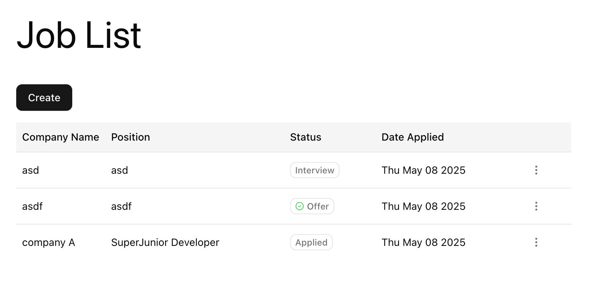
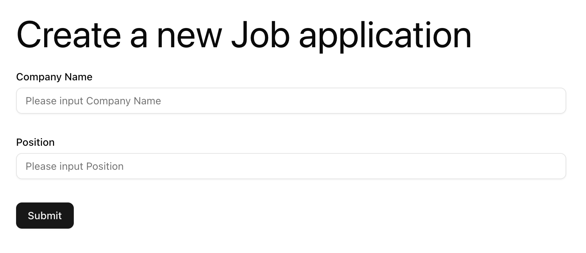
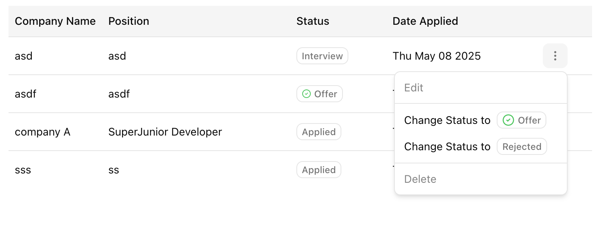
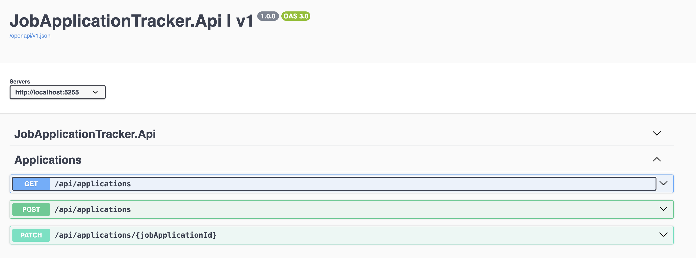

# Coding Test

2 applications

* FrontEnd: React application with 2 components to display list of applications and create new one as well as updating status
* BackEnd: Net Core Web Api to delivery RESTful API for FE

Assuming that the system skip the authentication and authorization part, and simply provide a RESTful API to the frontend application. The API has IdentityServer integrated, but not used in this demo.

In the real world, the system should have multiple roles for users to submit and view their applications while admin roles of the same company can view all applications and update their status. Do this would require a lot of work to implement the UI part and validate the user roles and secure the data

## UI Demo


**Application list page**


**Create a new Job Application**


**Dropdown menu to change status**

## How to run

### React Application

```bash
cd JobApplicationReact
npm install
npm run dev
```

### Net Core Web API

```bash
cd JobApplicationApi
dotnet run
```

## Front End React

Frontend application with tailwindCss integration

* Vite + React + Typescript
* React Router
* Tanstack Query
* React Hook Form
* TailwindCss
* Shadcn UI + components
* Tanstack Table

Project structure, inspired by [bulletproof-react](https://github.com/alan2207/bulletproof-react/blob/master/docs/project-structure.md), can be summarized as follows:

```sh
src
|
+-- apps              # application layer containing:
|   |                 # this folder might differ based on the meta framework used
|   +-- applications  # applications folder containing the job applications pages
|   +-- router.tsx    # application router configuration
+-- assets            # assets folder can contain all the static files such as images, fonts, etc.
|
+-- components/ui     # shared components mainly from shadcn/ui
|
+-- features          # feature based modules/components
|
+-- utils             # shared utility functions, currently for shadcn/ui
```

A feature folder could have the following structure:

```sh
src/features/job-allication
|
+-- api         # exported API request declarations
|
+-- components  # components scoped to a specific feature
|
+-- hooks       # hooks scoped to a specific feature
|
+-- utils       # utility functions for a specific feature
```

## Back End Net Core Api

In the backend side, Clean architeture is applied to provide enterprise application experiment and leverage the power of Clean architecture to extend and implement new features and functionalities

### Architecture

| Layer         | Project                 |
| ------------- | ----------------------- |
| Domain        | CodingTest.Domain       |
| Application   | CodingTest.Core         |
| Infrastruture | CodingTest.Persistentce |
| Presentation  | CodingTest.Api          |

Validation is done using FluentValidation, but throw exceptions instead of returning errors to the client. This can be changed to "service response" pattern if needed. 


**Support Swagger**

Restful API:

| Endpoint                     | Description                       |
| ---------------------------- | --------------------------------- |
| GET /api/applications        | Get all job applications          |
| POST /api/applications       | Create a new job application      |
| PATCH /api/applications/{id} | Update a job application (status) |

### Technologies

* [ASP.NET Core](https://docs.microsoft.com/en-us/aspnet/core/introduction-to-aspnet-core)
* [MediatR](https://github.com/jbogard/MediatR)
* [AutoMapper](https://automapper.org/)
* [FluentValidation](https://fluentvalidation.net/)

## References

* Clean architecture [github repository](https://github.com/jasontaylordev/CleanArchitecture)
* [Setup a simple controlled-based NET Core API](https://learn.microsoft.com/en-us/aspnet/core/tutorials/first-web-api?view=aspnetcore-9.0&tabs=visual-studio-code)
* React project structure insprired by this [github repo](https://github.com/alan2207/bulletproof-react/blob/master/docs/project-structure.md)
* [Setup Axios and react-query tutorial](https://medium.com/@cristafovici.den/master-data-fetching-with-axios-and-react-query-in-2024-part-1-7b10c5909eb1)
